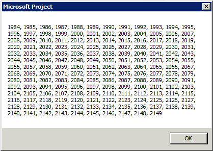

# Years Object (Project)

Contains a collection of  **[Year](060e541f-f709-65dd-c955-5d04c1554373.md)** objects.


## Remarks

The  **Years** collection in Project begins in 1984 and ends in 2149. In previous versions of Project, scheduling can run from 1984 to 2049.


## Examples

 **Using the Year Object**

Use  **Years** ( _Index_), where  _Index_ is the year index number, to return a single **Year** object. The following example counts the number of working days in the month of September 2012 for each selected resource.


```vb
Dim r As Resource
Dim d As Integer
Dim workingDays As Integer
Dim theMonth As PjMonth

theMonth = pjSeptember

For Each r In ActiveSelection.Resources()
    workingDays = 0
    With r.Calendar.Years(2012).Months(theMonth)
        For d = 1 To .Days.Count
            If .Days(d).Working = True Then
                workingDays = workingDays + 1
            End If
        Next d
    End With
    MsgBox "There are " &amp; workingDays &amp; " working days in " _
        &amp; r.Name &amp; "'s calendar for month " &amp; theMonth
Next r
```

 **Using the Years Collection**

Use the  **[Years](63f17754-d258-3fd2-5f20-33b8998e7e4d.md)** property to return a **Years** collection. The following example lists all the years in the calendar of the active project.


```
Sub CountYears()
    Dim c As Long
    Dim temp As String
        
    For c = 1 To ActiveProject.Calendar.Years.Count
        temp = temp &amp; ListSeparator &amp; " " &amp; _
            ActiveProject.Calendar.Years(c + 1983).Name
    Next c
            
    MsgBox Right$(temp, Len(temp) - Len(ListSeparator &amp; " "))
End Sub
```

Figure 1 shows the results of the  **CountYears** macro.


**Figure 1. Getting the list of years available**




## See also


#### Concepts


[Project Object Model](900b167b-88ec-ea88-15b7-27bb90c22ac6.md)