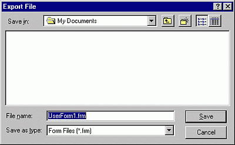

# Export File Dialog Box

Allows you to give a name to the exported file and choose a location where it will be saved.

## Dialog Box Options

 **Save in**

Select the folder where you want to store the file.

 **Up One Level**

Shows a list of folders or drives one level above the current folder.

 **Create New Folder**

Creates a new folder.

 **Details**

Shows the folder or documents in a list that includes the folder or document icon and name, its size (documents only), type, and the date and time it was last modified.

 **List**

Shows the folders or documents in a list format that includes the folder or document icon and its name.

 **File name**

Unless you specify a filename extension, Visual Basic automatically adds the default filename extension .frm for form, .bas for modules, or .cls for class modules.

 **List Files of Type**

Select a file type from the list:

- Form Files (*.frm) — Lists all forms.
    
- Basic Files (*.bas) — Lists all standard modules.
    
- Class Files (*.cis) — Lists all class modules.
    

