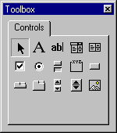

# Toolbox

Displays the standard Visual Basic controls plus any ActiveX controls and insertable objects you have added to your project.

- You can customize the  **Toolbox** by adding pages to it or by adding controls using the **Additional** **Controls** command from the **Tools** menu. When you add a page, a **Select** **Objects** tool is always available on the page.
    

## Standard Toolbox Controls

 **Select Objects**

Select Objects is the only item in the  **Toolbox** that doesn't draw a control. When you select it, you can only resize or move a control that has already been drawn on a form.

 **Label**

Allows you to have text that you do not want the user to change, such as a caption under a graphic.

 **TextBox**

Holds text that the user can either enter or change.

 **ComboBox**

Allows you to draw a combination list box and text box. The user can either choose an item from the list or enter a value in the text box.

 **ListBox**

Use to display a list of items from which the user can choose. The list can be scrolled if it has more items than can be displayed at one time.

 **CheckBox**

Creates a box that the user can easily choose to indicate if something is true or false, or to display multiple choices when the user can choose more than one.

 **OptionButton**

Allows you to display multiple choices from which the user can choose only one.

 **ToggleButton**

Creates a button that toggles on and off.

 **Frame**

Allows you to create a graphical or functional grouping for controls. To group controls, draw the frame first, and then draw controls inside the frame.

 **CommandButton**

Creates a button the user can choose to carry out a command.

 **TabStrip**

Allows you to define multiple pages for the same area of a window or dialog box in your application.

 **MultiPage**

Presents multiple screens of information as a single set.

 **ScrollBar**

Provides a graphical tool for quickly navigating through a long list of items or a large amount of information, for indicating the current position on a scale, or as an input device or indicator of speed or quantity.

 **SpinButton**

A spinner control you can use with another control to increment and decrement numbers. You can also use it to scroll back and forth through a range of values or a list of items.

 **Image**

Displays a graphical image from a [bitmap](vbe-glossary.md), [icon](vbe-glossary.md), or [metafile](vbe-glossary.md) on your form. Images displayed in an **Image** control can only be decorative and use fewer resources than a **PictureBox**.

