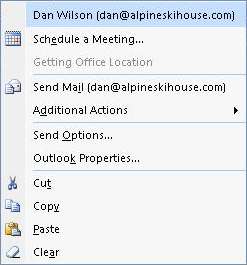

# OlkSenderPhoto Object (Outlook)

A control that displays the sender's contact picture for items that can be received via e-mail.

## Remarks

Before you use this control for the first time in the forms designer, add the Microsoft Outlook Sender Photo Control to the control toolbox. You can only add this control to a form region in an Outlook form using the forms designer; you cannot add this control to a Visual Basic  **UserForm** object in the Visual Basic Editor. This control supports Microsoft Windows themes.

If no contact item or contact picture exists for the sender, the control is blank. Right-clicking the control at runtime will display the sender's persona menu, an example of which is shown below.

Double-clicking the control will display the contact item inspector.

For more information about Outlook controls, see [Controls in a Custom Form](http://msdn.microsoft.com/library/fcba1b34-c526-5d01-8644-cb8852bd2348%28Office.15%29.aspx). For examples of add-ins in C# and Visual Basic .NET that use Outlook controls, see code sample downloads on MSDN. 

## Events

|**Name**|
|:-----|
|[Change](olksenderphoto-change-event-outlook.md)|
|[Click](olksenderphoto-click-event-outlook.md)|
|[DoubleClick](olksenderphoto-doubleclick-event-outlook.md)|
|[MouseDown](olksenderphoto-mousedown-event-outlook.md)|
|[MouseMove](olksenderphoto-mousemove-event-outlook.md)|
|[MouseUp](olksenderphoto-mouseup-event-outlook.md)|

## Properties

|**Name**|
|:-----|
|[Enabled](olksenderphoto-enabled-property-outlook.md)|
|[MouseIcon](olksenderphoto-mouseicon-property-outlook.md)|
|[MousePointer](olksenderphoto-mousepointer-property-outlook.md)|
|[PreferredHeight](olksenderphoto-preferredheight-property-outlook.md)|
|[PreferredWidth](olksenderphoto-preferredwidth-property-outlook.md)|

## See also

#### Other resources

[Outlook Object Model Reference](http://msdn.microsoft.com/library/73221b13-d8d8-99b8-3394-b95dbbfd5ddc%28Office.15%29.aspx)
