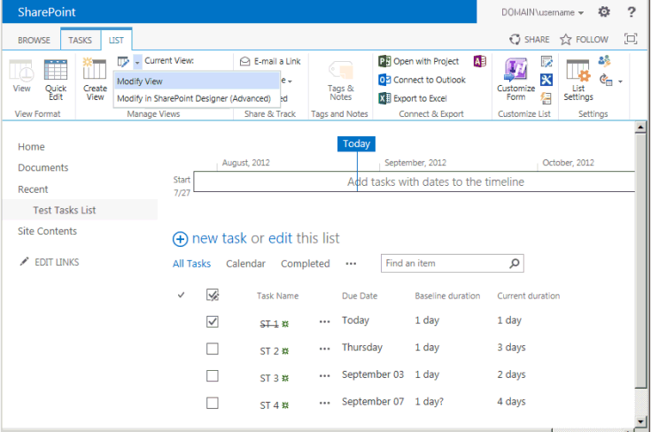

# Application.AddSiteColumn Method (Project)
Adds a column that becomes available for the tasks list in the synchronized SharePoint site for the active project.

## Syntax

 _expression_. **AddSiteColumn** _(ProjectField_,  _SharePointName)_

 _expression_ A variable that represents an **Application** object.


### Parameters


|**Name**|**Required/Optional**|**Data Type**|**Description**|
|:-----|:-----|:-----|:-----|
| _ProjectField_|Optional|**[PjField](pjfield-enumeration-project.md)**|Can be one of a subset of constants in the  **PjField** enumeration, which specifies the project field to show in the new column; cannot be one of the prohibited fields (see Remarks).|
| _SharePointName_|Optional|**Variant**|The name of the new column.|
| _ProjectField_|Optional|PJFIELD||
| _SharePointName_|Optional|VARIANT||
|Name|Required/Optional|Data type|Description|

### Return value

 **Boolean**

 **True** if the column is added.


## Remarks

The  **AddSiteColumn** method gives run-time error 1004, "Application-defined or object-defined error," in the following cases:


- The active project is not associated with a synchronized SharePoint tasks list. If the project is local, you can use the  **LinkToTaskList** method to create a synchronized SharePoint tasks list.

- The column name already exists in the SharePoint tasks list. To see the list of column names, open the tasks list in SharePoint, and then choose  **Modify View** on the **LIST** tab. The **Settings ? Edit View** page shows all of the column names that are available for the tasks list.

- The  _ProjectField_ value is a non-task field, such as **pjResourceActualCost**. A SharePoint tasks list shows task fields, not resource fields.

- The  _ProjectField_ value is an enterprise custom field such as **pjTaskEnterpriseProjectText1**, or a lookup table field such as  **pjTaskResourceEnterpriseRBS**. Local task custom fields, such as  **pjTaskText1**, are valid.

- The  _ProjectField_ value is one of the prohibited fields in Table 1. These fields are in addition to the prohibited resource fields and enterprise custom fields. The fields are prohibited because they are related to other prohibited fields, or have value types that are not supported in a default SharePoint tasks list.

    Although Table 1 and the other prohibited fields may appear to be a long list, of the 1,338 constants in  **PjField**, there are 357?including local task custom fields?that can be used with the  **AddSiteColumn** method.


~~~
**Table 1. Additional prohibited fields**
~~~

|                                                 |                                                    |                                                       |
|:------------------------------------------------|:---------------------------------------------------|:------------------------------------------------------|
| <strong>pjTaskActive</strong>                   | <strong>pjTaskActualOvertimeWork</strong>          | <strong>pjTaskACWP</strong>                           |
| <strong>pjTaskAssignmentDelay</strong>          | <strong>pjTaskAssignmentPeakUnits</strong>         | <strong>pjTaskAssignmentUnits</strong>                |
| <strong>pjTaskBaseline[1-10]BudgetCost</strong> | <strong>pjTaskBaseline[1-10]BudgetWork</strong>    | <strong>pjTaskBaseline[1-10]FixedCostAccrual</strong> |
| <strong>pjTaskBaselineBudgetCost</strong>       | <strong>pjTaskBaselineBudgetWork</strong>          | <strong>pjTaskBaselineFixedCostAccrual</strong>       |
| <strong>pjTaskBudgetCost</strong>               | <strong>pjTaskBudgetWork</strong>                  | <strong>pjTaskCalendarGuid</strong>                   |
| <strong>pjTaskConstraintDate</strong>           | <strong>pjTaskConstraintType</strong>              | <strong>pjTaskCostRateTable</strong>                  |
| <strong>pjTaskDeliverableGuid</strong>          | <strong>pjTaskDeliverableType</strong>             | <strong>pjTaskDemandedRequested</strong>              |
| <strong>pjTaskEarnedValueMethod</strong>        | <strong>pjTaskEnterpriseOutlineCode[1-30]</strong> | <strong>pjTaskExternalTask</strong>                   |
| <strong>pjTaskFinishSlack</strong>              | <strong>pjTaskFixedCostAccrual</strong>            | <strong>pjTaskFreeSlack</strong>                      |
| <strong>pjTaskGuid</strong>                     | <strong>pjTaskHideBar</strong>                     | <strong>pjTaskHyperlink</strong>                      |
| <strong>pjTaskHyperlinkAddress</strong>         | <strong>pjTaskHyperlinkHref</strong>               | <strong>pjTaskHyperlinkScreenTip</strong>             |
| <strong>pjTaskHyperlinkSubAddress</strong>      | <strong>pjTaskID</strong>                          | <strong>pjTaskIgnoreWarnings</strong>                 |
| <strong>pjTaskIndicators</strong>               | <strong>pjTaskIsAssignment</strong>                | <strong>pjTaskLevelAssignments</strong>               |
| <strong>pjTaskLevelDelay</strong>               | <strong>pjTaskLinkedFields</strong>                | <strong>pjTaskManual</strong>                         |
| <strong>pjTaskMilestone</strong>                | <strong>pjTaskNotes</strong>                       | <strong>pjTaskObjects</strong>                        |
| <strong>pjTaskOutlineCode[1-10]</strong>        | <strong>pjTaskOutlineLevel</strong>                | <strong>pjTaskOutlineNumber</strong>                  |
| <strong>pjTaskPathDrivenSuccessor</strong>      | <strong>pjTaskPathDrivingPredecessor</strong>      | <strong>pjTaskPathPredecessor</strong>                |
| <strong>pjTaskPathSuccessor</strong>            | <strong>pjTaskPreleveledFinish</strong>            | <strong>pjTaskPreleveledStart</strong>                |
| <strong>pjTaskPriority</strong>                 | <strong>pjTaskResourceType</strong>                | <strong>pjTaskStartSlack</strong>                     |
| <strong>pjTaskStatus</strong>                   | <strong>pjTaskStatusIndicator</strong>             | <strong>pjTaskSubproject</strong>                     |
| <strong>pjTaskSubprojectReadOnly</strong>       | <strong>pjTaskTotalSlack</strong>                  | <strong>pjTaskType</strong>                           |
| <strong>pjTaskWarning</strong>                  | <strong>pjTaskWorkContour</strong>                 | ****                                                  |

It is possible to add a field that already exists in the tasks list, if you use a unique name for the  _SharePointName_ parameter?although the value of doing so is questionable.


## Example

To use the  **AddDurationColumns** macro, create a tasks list in a SharePoint site, create a project in Project Professional, and then use the **LinkToTaskList** method to import the task list. Set a baseline for the active project by using the **Set Baseline** command on the **PROJECT** tab of the ribbon, and then change the duration of some tasks.

The  **AddDurationColumns** macro adds task duration and baseline duration to the list of available columns in the SharePoint task list (see Figure 1).


 **Note**  After you run the  **AddDurationColumns** macro, you must save the project in Project Professional to synchronize your changes with the SharePoint task list.


```vb
Sub AddDurationColumns()
    Dim success As Boolean
    Dim results As String
    Dim columnName As String
    Dim fieldName As PjField
    results = ""

    ' Add the first column.
    fieldName = pjTaskBaselineDurationText
    columnName = "Baseline duration"

    ' If the field name exists in the SharePoint tasks list, or fieldName
    ' is one of the prohibited fields, the AddSiteColumn method
    ' returns error 1100.
    On Error Resume Next

    success = AddSiteColumn(fieldName, columnName)

    If success Then
        results = "Added site column: " &; columnName
    Else
        results = "Error in AddSiteColumn: " &; columnName
    End If

    ' Add the second column.
    fieldName = pjTaskDurationText
    columnName = "Current duration"

    success = AddSiteColumn(fieldName, columnName)

    If success Then
        results = results &; vbCrLf &; "Added site column: " &; columnName
    Else
        results = results &; vbCrLf &; "Error in AddSiteColumn: " &; columnName
    End If

    Debug.Print results
End Sub
```

After you save the project, go to the task list in SharePoint. On the  **LIST** tab, select the **Modify View** command. On the Settings - Edit View page, select the **Baseline duration** field and the **Current duration** field that the **AddDurationColumns** macro added. Figure 1 shows the task list with the two new fields.


**Figure 1. Adding fields to a synchronized SharePoint task list**




## See also


#### Concepts


[Application Object](application-object-project.md)
[PjField Enumeration](pjfield-enumeration-project.md)
#### Other resources


[LinkToTaskList Method](application-linktotasklist-method-project.md)
