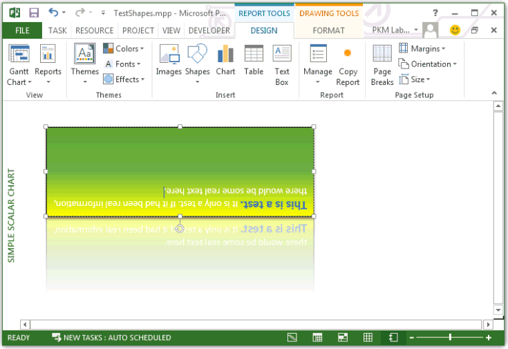

# Shape Object (Project)
Represents an object in a Project report, such as a chart, report table, text box, freeform drawing, or picture.

## Remarks

The  **Shape** object is a member of the **[Shapes](6e42040c-dd5a-de4c-afa8-f9e33d1e5054.md)** collection, which includes all of the shapes in the report.


 **Note**  Macro recording for the  **Shape** object is not implemented. That is, when you record a macro in Project and manually add a shape or edit shape elements, the steps for adding and manipulating the shape are not recorded.

There are three objects that represent shapes: the  **Shapes** collection, which represents all the shapes on a document; the **ShapeRange** object, which represents a specified subset of the shapes on a document (for example, a **ShapeRange** object could represent shapes one and four on the document, or it could represent all the selected shapes on the document); and the **Shape** object, which represents a single shape on a document. If you want to work with several shapes at the same time or with shapes within the selection, use a **ShapeRange** collection.

Use  `Shapes(Index)`, where  _Index_ is the shape name or the index number, to return a single **Shape** object.


## Example

In the following example, the  **TestTextShape** macro creates a textbox shape, adds some text, and changes the shape style, fill, line, shadow, and reflection properties. The **FlipShape** macro flips the shape from top to bottom.


```vb
Sub TestTextShape()
    Dim theReport As Report
    Dim textShape As Shape
    Dim reportName As String
    
    reportName = "Simple scalar chart"
    
    Set theReport = ActiveProject.Reports(reportName)
    Set textShape = theReport.Shapes.AddTextbox(msoTextOrientationHorizontal, 30, 30, 300, 100)
    textShape.Name = "TestTextBox"
    
    textShape.TextFrame2.TextRange.Characters.Text = "This is a test. It is only a test. " _
        &; "If it had been real information, there would be some real text here."
    textShape.TextFrame2.TextRange.Characters(1, 15).ParagraphFormat.FirstLineIndent = 0
    
    ' Set the font for the first 15 characters to dark blue bold.
    With textShape.TextFrame2.TextRange.Characters(1, 15).Font
        .Fill.Visible = msoTrue
        .Fill.ForeColor.ObjectThemeColor = msoThemeColorAccent5
        .Fill.Transparency = 0
        .Fill.Solid
        .Size = 14
        .Bold = msoTrue
    End With
    
    textShape.ShapeStyle = msoShapeStylePreset42
    
    With textShape.Fill
        .Visible = msoTrue
        .ForeColor.RGB = RGB(255, 255, 0)
        .Transparency = 0
        '.Solid
    End With
   
    With textShape.Line
        .Visible = msoTrue
        .ForeColor.ObjectThemeColor = msoThemeColorText1
        .ForeColor.TintAndShade = 0
        .ForeColor.Brightness = 0
        .Transparency = 0
    End With

    textShape.Shadow.Type = msoShadow22
    textShape.Reflection.Type = msoReflectionType3
End Sub

Sub FlipShape()
    Dim theReport As Report
    Dim theShape As Shape
    Dim reportName As String
    Dim shapeName As String
    
    reportName = "Simple scalar chart"
    shapeName = "TestTextBox"
    
    Set theShape = ActiveProject.Reports(reportName).Shapes(shapeName)

    theShape.Flip msoFlipVertical
    theShape.Select
End Sub
```

Figure 1 shows the result, where the shape is selected to make the ribbon  **FORMAT** tab under **DRAWING TOOLS** available, although the active tab is **DESIGN** under **REPORT TOOLS**. If the shape were not selected,  **DRAWING TOOLS** and the **FORMAT** tab would not be visible.


**Figure 1. Testing the Shape object model**




## See also


#### Other resources


[Report Object](38ef993e-e5cd-b451-06aa-41eb0e93450e.md)
[Chart Object](810d4ec1-69d2-c432-b9da-57042b783b85.md)